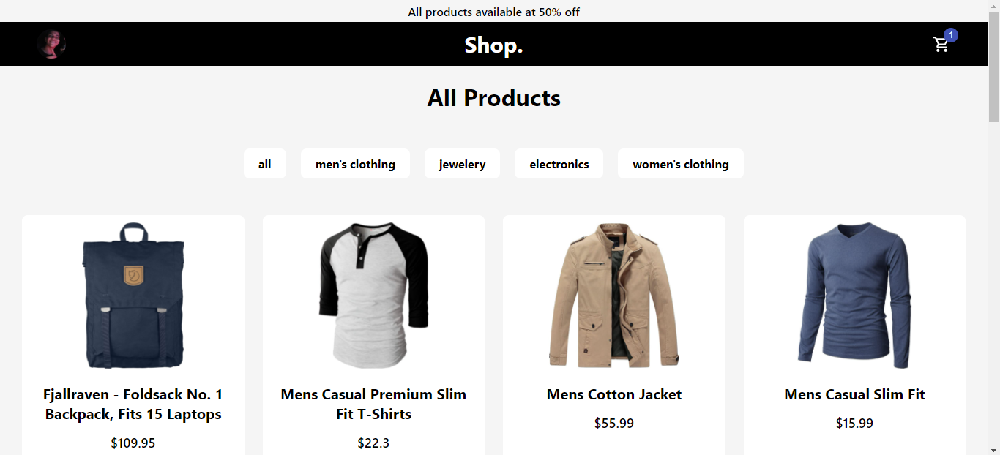

# Shop.

> E-commerce de roupas, acessórios e eletrônicos.

## ☕ Usando Shop.

Para usar Shop., clique no link abaixo:

[![Abrir com Firebase]](https://shop-react-redux-app.web.app/)

## 💻 Tecnologias

As tecnologias utilizadas para construir o Shop. foram:

- React
- JavaScript
- Redux Toolkit
- Styled Components
- Material UI
- Firebase

## 🤝 Colaborador

Agradecemos à seguinte pessoa que contribuíu para este projeto:

<table>
  <tr>
    <td align="center">
      <a href="https://github.com/gabomoreira">
         
        
          <b>Gabriel Moreira</b>
        
      </a>
    </td>
  </tr>
</table>
